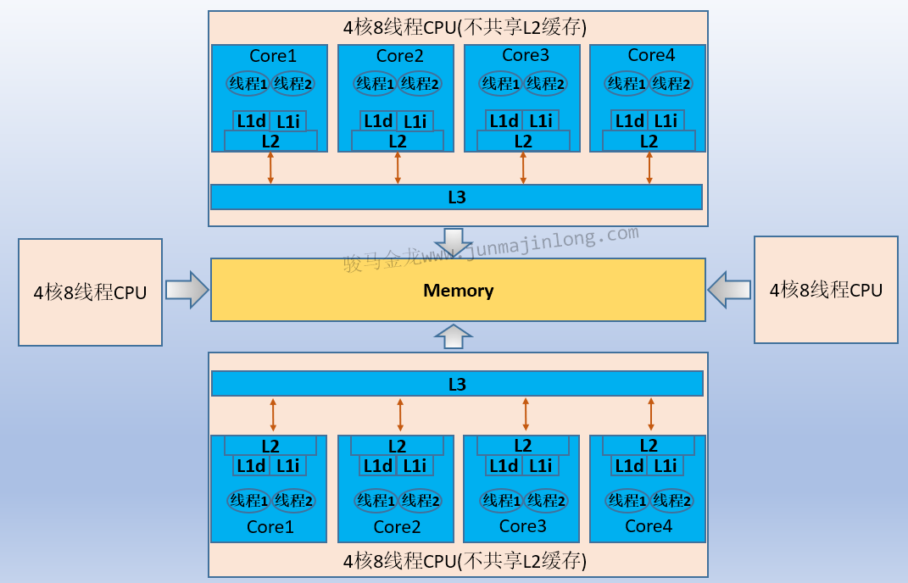
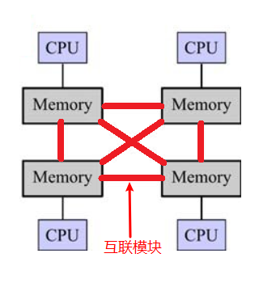
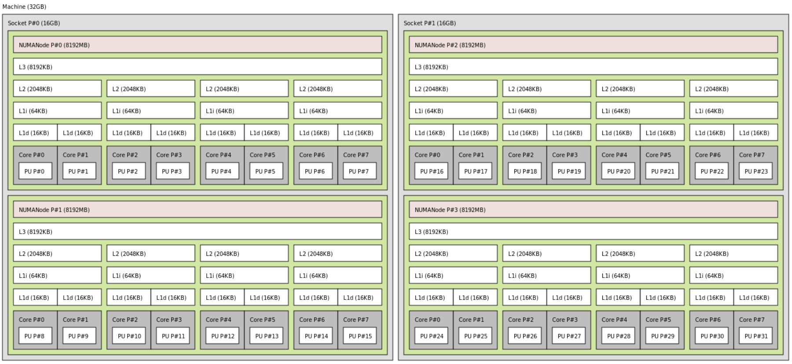

# 多CPU
对于多颗CPU的架构组织方式，有：
- AMP(Asymmetric multiprocessing)：非对称多处理器结构
- SMP(Symmetric multiprocessing)：对称多处理器结构
- UMA(Uniform memory access)：一致存储访问结构
- NUMA(Non-uniform memory access)：非一致存储访问结构
- MPP(massively parallel processing)：大规模(海量)并行处理结构

通常会拿来说明的是SMP和NUMA，MPP是海量并行处理结构。


# SMP
对称多处理结构，认为所有CPU的角色是平等的，所有CPU都共享内存、总线等资源。其实单颗多核的CPU内部的多核组织方式也是SMP结构，所有的核心都共享内存、总线资源。



对于SMP结构来说，由于每颗CPU都需要操作共享存储：内存，所以需要保证内存数据的一致性(即缓存一致性)。比如CPU1里的Core1修改数据A，假如采用bus snooping缓存一致性策略，需要在总线发送广播通知所有CPU的所有Core使它们对数据A的缓存失效。如果CPU数量较少，问题并不大，但是随着CPU数量增多，因缓存一致性和共享对象导致的总线流量会暴增。

所以SMP结构并不利于扩展更多CPU，比如2-4颗CPU可考虑SMP架构，但4颗CPU以上便不适合使用SMP。

# NUMA
NUMA(非一致存储访问结构)结构使得各个CPU有自己的内存资源，通过各CPU之间的互联模块，各CPU也可以访问其它CPU的内存资源。



因为CPU都有自己本地的内存，可以各自管理自己的内存保证自己的缓存一致性。但是，因为各CPU各自的内存分离开了，使得CPU1通过互联模块访问CPU2的内存速度很慢(因为通过中间数据传输介质且距离更远)，所以使用NUMA结构时，程序应尽量避免CPU之间的交互并行。

此外，CPU数量越多，跨CPU访问内存的距离可能会越远，速度会越差，所以NUMA结构的性能并不能随CPU数量的增加而线性增长。

下图是4个CPU组成NUMA结构，总共32核，总共分配32G内存，每颗CPU分配8G内存作为自己的本地内存。



```
转载自：
作者: 骏马金龙
链接: https://www.junmajinlong.com/os/multi_cpu/
来源: 骏马金龙
著作权归作者所有。商业转载请联系作者获得授权，非商业转载请注明出处。
```